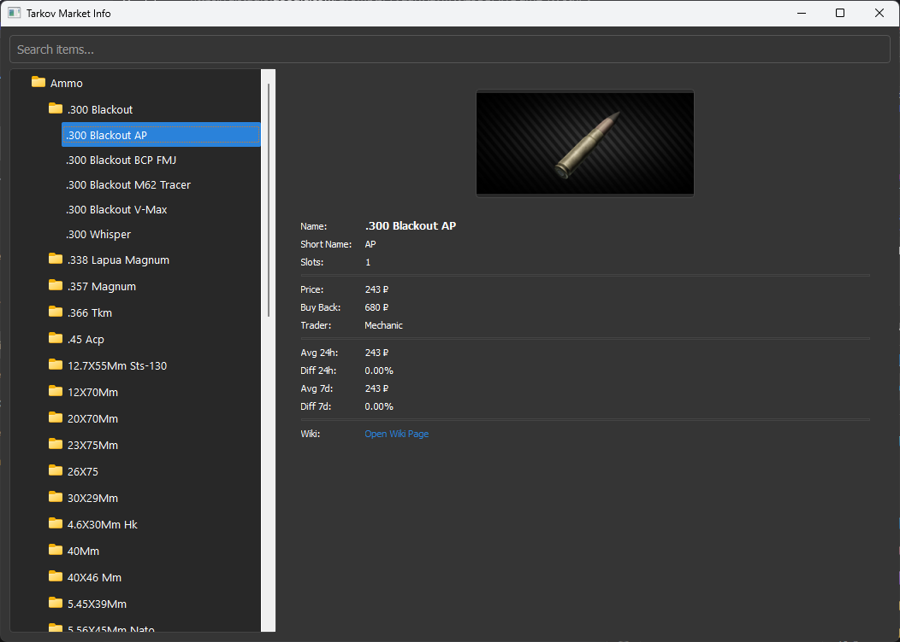

# Tarkov Market App

[](https://opensource.org/licenses/MIT) <!-- Optional: Add a license badge -->

A simple desktop application to browse and search for items from the game Escape from Tarkov, displaying market data and item details.

**Data Source Note:** This app fetches item data from a **publicly published Google Sheet CSV**, originally curated by sources like tarkov-market. It does **not** use any private APIs or require authentication. An internet connection is required for the initial data fetch and subsequent updates.



## Features

*   Browse items categorized by type (Ammo, Gear, Meds, etc.).
*   Search items by name with live filtering.
*   View detailed item information:
    *   Flea market prices (Last, 24h Avg, 7d Avg)
    *   Trader buyback prices
    *   Item slot size
    *   Price difference percentages
*   Display item images (fetched from external links).
*   Direct link to the item's wiki page.
*   Modern dark theme UI.

## Installation / Getting Started

There are two ways to use the app:

### Option 1: Download Pre-compiled Release (Recommended for most users)

1.  Go to the [**Releases**](https://github.com/ThomofBiloxi/TarkovMarket/releases) section of this repository.
2.  Download the latest `.zip` file for Windows (e.g., `TarkovMarketApp-vX.Y-Windows.zip`).
3.  Extract the contents of the `.zip` file to a folder on your computer.
4.  Double-click `TarkovMarketApp.exe` inside the extracted folder to run the application.

### Option 2: Running from Source (For developers or advanced users)

**Prerequisites:**
*   [Python](https://www.python.org/downloads/) (version 3.8 or newer recommended)
*   [Git](https://git-scm.com/downloads/)

**Steps:**

1.  **Clone the Repository:**
    ```bash
    git clone https://github.com/ThomofBiloxi/TarkovMarket.git
    cd TarkovMarket
    ```

2.  **Create and Activate a Virtual Environment (Recommended):**
    ```bash
    # Create venv
    python -m venv venv
    # Activate venv
    # Windows (PowerShell)
    .\venv\Scripts\activate
    # Windows (CMD)
    .\venv\Scripts\activate.bat
    # macOS / Linux
    source venv/bin/activate
    ```
    *(If you encounter PowerShell execution policy errors on Windows, see [this guide](https://learn.microsoft.com/en-us/powershell/module/microsoft.powershell.core/about/about_execution_policies?view=powershell-7.4) or run `Set-ExecutionPolicy -ExecutionPolicy RemoteSigned -Scope Process` in an Admin PowerShell)*

3.  **Install Dependencies:**
    ```bash
    pip install -r requirements.txt
    ```

4.  **Run the Application:**
    ```bash
    python main_app.py
    ```

## Building the Executable (Optional)

If you want to build the executable yourself:

1.  **Follow steps 1-3** from the "Running from Source" section above to set up the environment and install dependencies.
2.  **Install PyInstaller** (if not already included via `requirements.txt`):
    ```bash
    pip install pyinstaller Pillow
    ```
    *(Pillow is helpful for asset handling, though the main app uses pre-generated ones)*
3.  **Ensure Assets Exist:** Make sure the `placeholder.png` and `error.png` files (the *opaque* versions generated previously) are present in the root project directory. Optionally, add an icon file (e.g., `app_icon.ico` for Windows).
4.  **Run PyInstaller:** Execute the following command from the project root directory (ensure `venv` is active):

    ```powershell
    # Command for PowerShell (uses backticks ` for line continuation)
    pyinstaller --name TarkovMarketApp `
    --onefile `
    --windowed `
    --add-data "placeholder.png;." `
    --add-data "error.png;." `
    --icon="app_icon.ico" `
    main_app.py
    ```
    *   *(Remove the `--icon` line if you don't have an icon file.)*
    *   *(For CMD on Windows, replace backticks ` with carets ^)*
    *   *(For macOS/Linux, replace backticks ` with backslashes \ and use `:` instead of `;` in `--add-data`, e.g., `--add-data "placeholder.png:."`)*

5.  **Find the Executable:** The generated executable (`TarkovMarketApp.exe` on Windows) will be located inside the `dist` folder.

## Usage Notes

*   **Database:** The first time you run the app (or if the database is missing), it will attempt to download the latest item data from the public Google Sheet and create a local SQLite database file (`tarkov_data.db`).
*   **Database Location:** This database is stored in your user-specific application data directory to keep your project folder clean. Examples:
    *   Windows: `C:\Users\<YourUser>\AppData\Local\TarkovMarketApp\TarkovMarketApp`
    *   macOS: `/Users/<YourUser>/Library/Application Support/TarkovMarketApp`
    *   Linux: `/home/<YourUser>/.local/share/TarkovMarketApp`
*   **Updates:** Currently, the app only updates the database if the local file is missing. To force an update, you would need to manually delete the `tarkov_data.db` file from the location mentioned above.

## License

This project is licensed under the MIT License - see the [LICENSE](LICENSE) file for details (assuming you add an MIT license file).